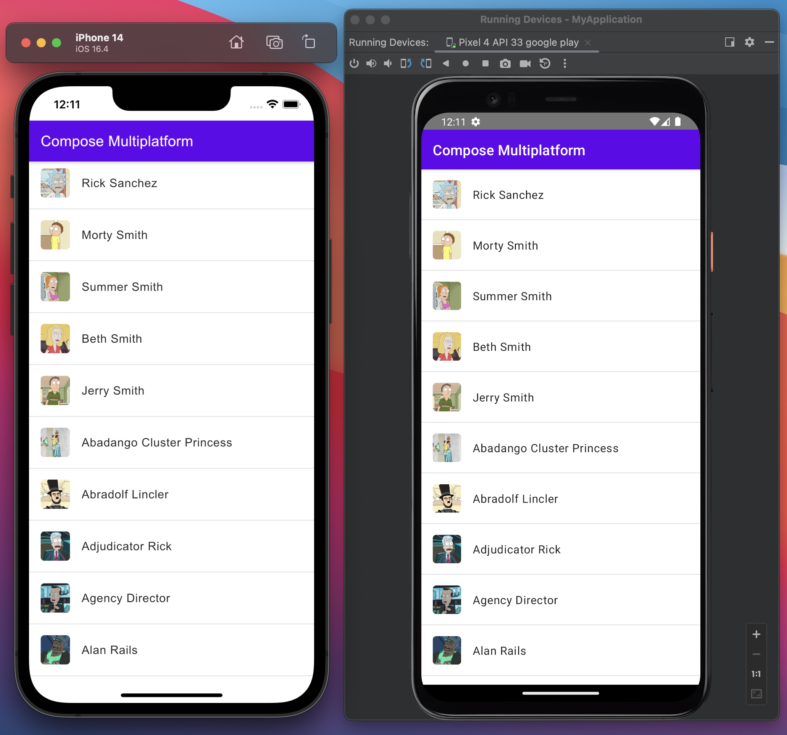

## Compose Multiplatform Demo
This project is a Kotlin Multiplatform Mobile(KMM) demo that uses Compose to write a fully shared code between Android and Ios including UI.

## App Content
This app will show a list of characters (Name and Image) of the television show Rick and Morty. 



## This app has the following functionalities:
- Pagination by page number
- Pull to refresh.
- Loading item inside the list during the api request.
- Error item inside the list if api request failed that include a retry button.
- VersionCatalog to manage dependencies.
- Multiplatform resources.
- ViewModel with Koin DI.
- Type-safe compose navigation.
- Shimmer Animation.
- Shared-elements transition.
- Offline cache by database (Room)

## Setup
Before you run this project, use the [KDoctor](https://github.com/Kotlin/kdoctor) tool to ensure that your development environment is configured correctly:

1. Install KDoctor with [Homebrew](https://brew.sh/):

    ```text
    brew install kdoctor
    ```

2. Run KDoctor in your terminal:

    ```text
    kdoctor
    ```

   If everything is set up correctly, you'll see valid output:

   ```text
   Environment diagnose (to see all details, use -v option):
   [✓] Operation System
   [✓] Java
   [✓] Android Studio
   [✓] Xcode
   [✓] Cocoapods
   
   Conclusion:
     ✓ Your system is ready for Kotlin Multiplatform Mobile development!
   ```

Otherwise, KDoctor will highlight which parts of your setup still need to be configured and will suggest a way to fix them.

## API Used In This Project
- [Rick and Morty API](https://rickandmortyapi.com/).

## Libraries Used In This Project
- [Jetpack Compose](https://developer.android.com/jetpack/compose): for UI.
- [Coroutine](https://github.com/Kotlin/kotlinx.coroutines): to request data from server on thread other than UI thread. 
- [Ktor](https://ktor.io/docs/getting-started-ktor-client.html): to make api calls.
- [Kotlinx-Serialization](https://github.com/Kotlin/kotlinx.serialization): to deserialize api response. 
- [Compose ImageLoader](https://github.com/qdsfdhvh/compose-imageloader): to load images from url.
- [Koin](https://github.com/InsertKoinIO/koin): to inject dependencies (DI).
- [Lifecycle](https://developer.android.com/jetpack/androidx/releases/lifecycle) to have Google's implementation of ViewModel.
- [Compose Navigation](https://central.sonatype.com/artifact/org.jetbrains.androidx.navigation/navigation-compose) to have Jetbrains implementation of Compose Navigation
- [Room](https://developer.android.com/jetpack/androidx/releases/room) to have offline cache.

## Disclaimer
- Project configurations is based on this [template](https://github.com/JetBrains/compose-multiplatform-ios-android-template#readme)
- Kindly note that Compose Multiplatform is still in alpha, so it is subject to change and may require manual migration proceess when it is released.

## Let me know!
If you have any questions or suggestion please contact me on malbdour92@gmail.com

## About
Find me on LinkedIn: https://www.linkedin.com/in/mobidroid92/
